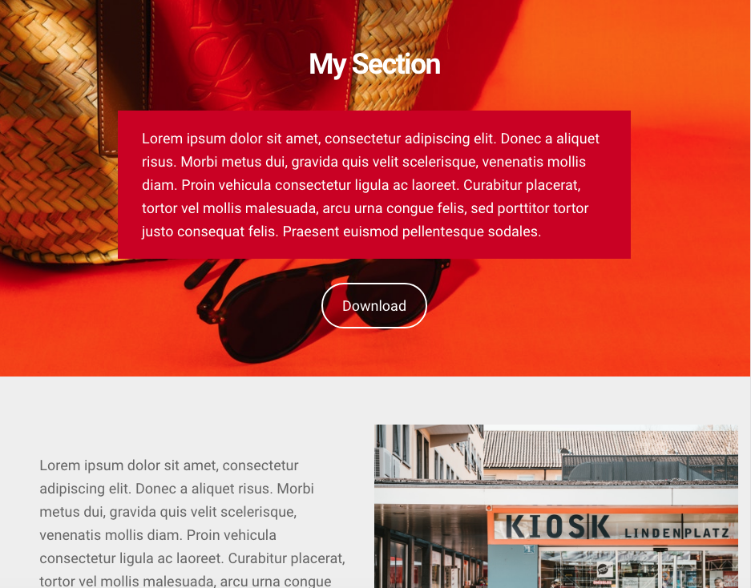

# Gutenberg Editor Section

This WordPress plugin adds a new block to create Sections and wrap other blocks inside it.

## Features

- Margin top and bottom
- Padding top and bottom
- Margin and Padding uses classes to allow better responsive control over media queries
- Background image, with fixed and opacity options
- Background color
- Option to use full height size of viewport
- Block align full only

## TODO

- Background gradient based on two colors
- Background video

## Building

This project was bootstrapped with [Create Guten Block](https://github.com/ahmadawais/create-guten-block).

Below you will find some information on how to run scripts.

>You can find the most recent version of this guide [here](https://github.com/ahmadawais/create-guten-block).

## 👉  `npm start`
- Use to compile and run the block in development mode.
- Watches for any changes and reports back any errors in your code.

## 👉  `npm run build`
- Use to build production code for your block inside `dist` folder.
- Runs once and reports back the gzip file sizes of the produced code.